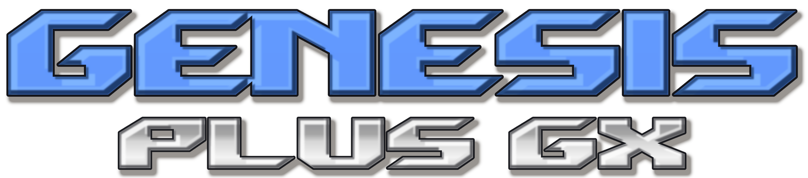

# Genesis Plus GX — Windows GUI

A native Win32 frontend for [Genesis Plus GX](https://github.com/ekeeke/genesis-plus-gx),
built directly against the emulator core. It sits alongside the existing `sdl/`
and `gx/` ports as a new `win32/` port.

No SDL. Video goes through GDI or, optionally, Direct3D 9 or Direct3D 11
(**Video → Renderer**); sound through waveOut, gamepads through XInput.
The finished executable depends only on DLLs that ship with Windows.

Supports everything the core does: Mega Drive / Genesis, Master System,
Game Gear, SG-1000, Mega CD / Sega CD, and Pico.

---

## Building

You need MinGW-w64 (with its C++ compiler, `g++`) and zlib. Nothing else.

**It builds as either 32-bit or 64-bit**, depending on which compiler you point
it at. The render filters are built into the executable, so nothing depends on
the pointer size. (An earlier version loaded Kega Fusion `.rpi` plugin DLLs,
which are 32-bit and cannot be loaded into a 64-bit process; that was the only
reason it used to be 32-bit only.)

**On Windows, from an MSYS2 shell** — the shell you open decides the
architecture:

1. Install [MSYS2](https://www.msys2.org/) (the installer is a normal `.exe`;
   accept the defaults). It installs to `C:\msys64` and adds a few Start Menu
   shortcuts.
2. Open **"MSYS2 MINGW64"** for a 64-bit build, or **"MSYS2 MINGW32"** for a
   32-bit one, from the Start Menu — not the plain "MSYS2" shortcut, which is
   a different environment and will not build this.
3. The first time only, update the package database (it may ask you to close
   and reopen the window partway through — that's normal, just reopen the
   same shortcut and run it again):
   ```sh
   pacman -Syu
   ```
4. Install the compiler and dependencies for the architecture you opened:
   ```sh
   # in "MSYS2 MINGW64":
   pacman -S mingw-w64-x86_64-gcc mingw-w64-x86_64-zlib make
   # in "MSYS2 MINGW32":
   pacman -S mingw-w64-i686-gcc mingw-w64-i686-zlib make
   ```
5. `cd` to the `win32` folder. MSYS2 shows Windows drives under `/c`, `/d`
   and so on, so `C:\Users\You\Downloads\genesis-plus-gx\win32` is
   `cd /c/Users/You/Downloads/genesis-plus-gx/win32`.
6. Build:
   ```sh
   make -f Makefile.win32
   ```

`gpgx.exe` appears in the same `win32` folder — a native Windows executable,
runnable directly outside MSYS2 (double-click it, or copy it wherever you
like). The Direct3D 9 and Direct3D 11 renderers link against import libraries
that ship with the standard `mingw-w64-*-gcc` package above, so no extra
package is needed for them.

**Cross-compiling from Linux:**

```sh
sudo apt install mingw-w64 libz-mingw-w64-dev make
cd win32
make -f Makefile.win32 CROSS=x86_64-w64-mingw32-      # 64-bit
make -f Makefile.win32 CROSS=i686-w64-mingw32-        # 32-bit
```

Either way you get `gpgx.exe`. To keep both builds side by side, give each its
own object directory and name:

```sh
make -f Makefile.win32 CROSS=x86_64-w64-mingw32- OBJDIR=./build_w64 NAME=gpgx64.exe
```

### Build options

| Option | Effect |
|---|---|
| `DEBUG=1` | Keep symbols, disable optimisation |
| `CHD=0` | Drop `.chd` support (skips libchdr and its lzma/zstd deps) |
| `OGG=0` | Drop OGG CD audio (skips the bundled Tremor decoder) |

`CHD` and `OGG` are on by default and build from sources already in the
repository, so none of them adds an external dependency. Turning them off roughly
halves the build time if you only care about cartridge games.

**About headers like `<windows.h>` you won't find in this repository:** these
are system headers that ship with the compiler itself, not project files —
the same way `<stdio.h>` isn't something any C project includes a copy of.
MinGW-w64 (from the `pacman` packages above, or `apt install mingw-w64` on
Linux) installs its own complete set of Windows API headers, including
`windows.h`, `d3d9.h`, `d3d11.h` and everything else this project includes
in angle brackets (`<...>`) rather than quotes (`"..."`). Only headers
included in quotes, like `"d3d9_video.h"`, are project files you'll find
in this `win32` folder.

---

## Installing

Put `gpgx.exe` wherever you like. On first run it creates its own folders next
to itself:

```
gpgx.exe
gpgx.ini            settings
bios/               optional BIOS and add-on ROMs
saves/              battery saves (.srm) and Mega CD backup RAM (.brm)
states/             save states
screenshots/        PNG captures, named <game>_YYYYMMDD_HHMMSS.png
cheats/             per-ROM cheat lists (.cht)
```

Per-game files -- battery saves (`saves/`), save states (`states/`) and cheat
lists (`cheats/`) -- are grouped by console and named after the game plus an
8-digit id made from the game's own data:

```
saves/MegaDrive/Sonic The Hedgehog [A1B2C3D4].srm
states/MasterSystem/Alex Kidd [0F3E9C21].gp0
```

Console folders are `MegaDrive`, `MasterSystem`, `GameGear`, `SG1000` and
`MegaCD`. The id means two different games (or a ROM hack) that happen to share
a file name never share saves, while the same game as a `.zip` and as a plain
file does. Files from earlier versions (`saves/<name>.srm`) are moved into the
new layout the first time a game with that name is played. Mega CD games are
identified by their disc header, and the shared RAM-cartridge file
`saves/cart.brm` is unchanged. Cover images use the same console folders (`covers/MegaDrive/<game name>.png` and so on) and are still matched by file name, since the browser does not read every ROM; a cover left in the flat `covers/` folder by an earlier version is still shown when there is none in the console's folder.

Everything is relative to the executable, so the whole folder can be copied to
a USB stick and it will keep working.

On Windows 10 (version 1903) and later the program runs with the UTF-8 code page,
so game and folder names with non-English characters work; on older Windows the
system's ANSI code page applies, as before.

### Optional ROMs

Drop these in `bios/` if you have them. All are optional except the Mega CD
BIOS files, which Mega CD games need (the one matching the game's region); games
that do not need the others run without.

| File | Used for |
|---|---|
| `bios_MD.bin` | Mega Drive TMSS boot ROM |
| `bios_CD_U.bin`, `bios_CD_E.bin`, `bios_CD_J.bin` | Mega CD, by region |
| `bios_U.sms`, `bios_E.sms`, `bios_J.sms`, `bios.gg` | Master System / Game Gear |
| `ggenie.bin`, `areplay.bin` | Game Genie, Action Replay |
| `sk.bin`, `sk2chip.bin` | Sonic & Knuckles lock-on |

Turn the BIOS on under **Options → Boot from BIOS When Available**.

---

## Using it

Open a ROM with **File → Open**, drag one onto the window, pass it on the
command line, or browse a folder with **File → ROM Browser** (Ctrl+B). ZIP
and GZ archives work directly. The window remembers its position, size and
maximized state between runs.

### Keyboard

| | |
|---|---|
| Arrow keys | D-pad |
| Z, X, C | A, B, C |
| A, S, D | X, Y, Z |
| Enter | Start |
| Right Shift | Mode |

A connected gamepad works with no setup, laid out the way a 6-button Control
Pad expects: face buttons give B and C, X gives A, the shoulders give X and Z.
Change any of it under **Input → Configure Player**.
**Input → Enable Background Input** keeps the controls working while another
window has focus (keyboard pad keys and gamepads only; hotkeys and the mouse
still need the emulator window to be active).

### Shortcuts

| | |
|---|---|
| Ctrl+O | Open a ROM |
| Ctrl+B | ROM Browser |
| Ctrl+W | Close the ROM |
| Ctrl+R / Ctrl+Shift+R | Reset / hard reset |
| Ctrl+C | Cheats |
| F2 | Pause and resume |
| F3 | Stop the ROM |
| F5 / F8 | Save / load the current slot |
| F6 / F7 | Previous / next slot |
| F9 | Undo the last state load |
| F12 | Save a screenshot |
| Shift+F11 | Record video + audio (start / stop) |
| Ctrl+F11 | Record audio only (start / stop) |
| Alt+F11 | Stop recording |
| Alt+Enter | Toggle fullscreen |
| Esc | Show/hide the menu bar (while fullscreen) |
| Tab (Hold) | Fast forward |
| Backspace (Hold) | Rewind |
| `\` | Advance one frame while paused |

Assigning a control works by listening rather than by picking from a list:
select a button, choose Assign, then press what you want it to be. The same
pass catches keyboard keys and gamepad buttons, so there is no separate mode
for controllers.

### Cheats

**Tools → Cheats...** opens a list where you can paste Game Genie or
Action Replay codes, tick them on and off, and give each one a name. Codes are
saved per ROM under `cheats/<name>.cht` and reload automatically the next time
that ROM runs.

**Enable Cheats** is off until you turn it on. Select a code in the list to see
its name and code in the fields underneath; change them and press **Save** to
update that entry where it is (it keeps its place in the list). **Add code**
adds a new one. The same list opens from **Edit Cheats** on a ROM's right-click
menu in the browser, without starting the game, and is saved the same way.

Accepted formats depend on the console, same as the codes you'd find in any
cheat database:

| Console | Formats |
|---|---|
| Mega Drive / Genesis | Game Genie (`ABCD-EFGH`), raw patch (`aaaaaa:dddd`) |
| Master System / Game Gear / SG-1000 | Game Genie (`ABC-DEF`, or `ABC-DEF-GHI` with a reference byte), Action Replay (`00XX-YYYY`), raw RAM (`aaaa:dd`) |

Toggling a code takes effect immediately, with no need to reset.

On the Mega Drive, a code whose value is `00` followed by a byte (for example
`FFFE12:0009`) writes that one byte at exactly the address it names; a value
with a non-zero first byte (`FFFE12:0900`) writes both bytes. Earlier versions
put a byte code on the neighbouring address instead, so a code that only worked
because of that (for example `FFFE20:00C8` for Sonic's rings) needs its address
moved by one (`FFFE21:00C8`).

### ROM Browser

**File → ROM Browser** (Ctrl+B) scans a folder for ROMs and lists them —
double-click one, or select it and press **Play**, to launch it. **Change...**
picks a different folder; **Refresh** rescans after adding files. The scan
goes into subfolders (six levels deep, capped at 4000 files, generous for how
anyone actually organises a collection) and recognises the same file types
the Open dialog does. A standalone `.bin` is hidden when a `.cue` with the
same name sits next to it, since the `.cue` is the real entry point for that
Mega CD dump.

### Render Filters

**Video → Render Filter** applies a CPU pixel filter to the game image before
it is scaled to the window. They are built into the executable, so there is
nothing to install and nothing to load:

| Filter | Output | What it does |
|---|---|---|
| Scale2x | 2x | AdvMAME's pixel-art scaler; smooths diagonals, keeps everything else |
| Scale3x | 3x | The same idea at 3x, smoother still |
| Eagle 2x | 2x | The classic Eagle rules; tends to thin single-pixel lines |
| Smooth 2x (xBR-style) | 2x | Edge-directed corner smoothing; see below |
| Smooth 4x (xBR-style) | 4x | Two passes of the above; the softest, roundest result |
| **xBRZ 2x – 6x** | 2x – 6x | **The real xBRZ.** Anti-aliased, almost vector-like curves and clean thin lines; see below |
| Scanlines 2x | 2x | Every second row dimmed |
| CRT 3x (RGB mask) | 3x | Red/green/blue phosphor stripes plus scanlines, about 80% of source brightness |
| Sharp 4x | 4x | Plain pixel replication, no smoothing. With **Smooth scaling** on this is the well-known "sharp bilinear" look: crisp pixels without shimmer at non-integer window sizes |

Each filter's output size is fixed by the filter itself; the final resize to
the window is done afterwards through Direct3D or `StretchBlt` and follows your
**Smooth scaling** setting. A filter is mutually exclusive with the built-in
NTSC filter — turning one on turns the other off — since running one image
reshaper after the other is a combination nothing here has examined.

**xBRZ.** This is Zenju's actual xBRZ code, not a lookalike, at its default
settings — the same algorithm the xBRZ render plugins for Kega Fusion were
built from. It is the best-looking filter here on curves, diagonals and thin
lines, and it is anti-aliased: unlike Scale2x or Smooth it blends colours, so
the result is softer, and very small details (a one-pixel eye) come out a touch
dimmer than the source. Higher multipliers give smoother curves; 3x or 4x is a
good everyday choice, 6x is for large displays.

Things to know about it:

- **Memory.** xBRZ keeps a 64 MB colour-distance table. It is built when you
  select an xBRZ filter (about a tenth of a second) and freed when you switch
  to anything else, so it costs nothing unless you are using it. Expect about
  80-100 MB more while it is active, more at 5x/6x on tall interlaced frames.
- **Cost.** About 1 ms per frame at 2x, 2 ms at 4x, under 4 ms at 6x on a
  320x224 frame; up to about 9 ms for a 6x interlaced frame. Frames that are
  nearly all noise, which real games do not produce, take up to 10-30 ms.
- **Direct3D texture size.** 6x of an interlaced frame is a 1920x2688 texture.
  Almost all GPUs accept that; one that does not falls back to the slower GDI
  path for those frames rather than showing nothing.
- **Fidelity.** The port was checked to give bit-for-bit the same output as
  the untouched original at every factor from 2x to 6x; the only step added is
  rounding its 8-bit result back to the 5/6/5 bits the frame buffer holds.


**What "Smooth (xBR-style)" is, and is not.** It is not hqx and it is not
xBRZ. It is a compact, independently written edge-directed smoother built on
the same idea as xBR: for every corner of every source pixel, compare how much
colour changes along the two diagonals through it, and if the edge runs
across that corner, blend the corner toward the neighbour it belongs to.
It is cruder than xBRZ but crisper (it does not soften small details), much
cheaper, and — unlike xBRZ — carries no licence restriction. Two rules keep it
from damaging detail: a corner is only cut when the pixel actually continues
away from it (so single-pixel eyes, letter dots and 1-pixel lines are left
alone — an early version without this rule smudged them), and similarity uses
a tolerance so dither patterns and flat areas are untouched.


**Cost of the others.** Measured on a desktop CPU with an optimised build, on
320x224 frames: Scale2x, Eagle, Scanlines and Sharp are well under 1 ms; Scale3x
and CRT are under 1 ms; Smooth 2x is about 1 ms; Smooth 4x is about 3.5 ms
(about 7 ms on 320x448 interlaced frames). A frame of pure random noise, which
no game produces, takes up to 14 ms at Smooth 4x.

**Upgrading from the `.rpi` build.** `.rpi` files are no longer used, the
`filters\` folder is no longer created, and **Filter Scale** and **Rescan
filters folder** are gone (xBRZ now comes in fixed 2x-6x entries instead). If
your settings file names a plugin that happens to match a built-in
("Scale2x.rpi"), it carries over; anything else falls back to no filter. The
obsolete `rpi_filter` / `rpi_scale` keys are removed the next time settings
are saved.

**Adding your own.** A filter is one function in `filters.c` —
`void f(const uint16_t *src, int src_pitch, int w, int h, uint16_t *dst, int dst_pitch)`
producing exactly `scale` times as many pixels each way — plus one line in the
table at the bottom of the file. The menu is built from that table, and
`filters.c` has no Windows dependency, so it can be built and tested on its own.
`tests/filters_test.c` does exactly that — no Windows and no emulator core
needed; the build commands are at the top of the file.

---

## Advanced Audio

**Audio → Advanced...** exposes the rest of the core's sound options:

- **Audio Filter:** Off, Low-Pass (a gentle smoothing that mimics the console's
  analog output; its strength is adjustable, 60% by default), or a 3-Band EQ
  with low / mid / high gains (100% is flat) and the two crossover frequencies.
- **High-Quality FM Synthesis:** band-limited rendering of the FM chip (on by
  default) instead of cheaper linear resampling.
- **Master System FM Unit / Chip:** whether the YM2413 FM sound unit is used
  (auto, off, on) and which emulation renders it (MAME or Nuked).
- **Sega CD PCM Volume:** separate from the CD Audio slider in Levels and Latency.

**Audio → FM Chip** picks the Genesis FM chip emulation: YM2612 (MAME, Discrete)
is the early console's chip including its DAC "ladder" distortion, YM3438 (MAME,
ASIC) is the later chip built into the console's ASIC, YM3438 (MAME, Enhanced)
is a cleaner 14-bit variant, and the two Nuked entries are the slower,
cycle-accurate core behaving as a YM2612 or a YM3438. Changing the chip or the
FM unit while a game runs can leave some instruments quiet until the game
re-sends them or you reset. All of these are locked during netplay.

## More Video Options

- **Video → Visual Effects → LCD Ghosting:** bright pixels fade over the next
  frame instead of vanishing at once (Off, Light, Medium, Heavy), like a slow
  handheld LCD. Not used together with the NTSC filter.
- **Video → Frameskip:** Off, Auto, or Manual. Skipping means a frame is run
  but not drawn, which lets a slow PC catch up; the sound and the game itself
  are unaffected. The sound card sets the pace, so "behind" means its buffer is
  running low: Auto skips when it is nearly empty, Manual when it drops below
  25%, 33%, 50% or 75%. At most four frames in a row are skipped. It is not used
  during netplay or recording.
- **Video → Borders → Interlaced Mode:** Single Field (the default) or Double Field.
  Some games (Sonic 2 two-player, Combat Cars) use a 448-line interlaced mode;
  Double Field shows both fields at twice the height.
- **Options → Show Master System Side Borders:** off by default, so 8 pixels are
  cropped off each side of Master System pictures, hiding the column games blank
  to mask scrolling. Turn it on to see the whole picture. It has no effect while **Video → Borders** already
  shows the left/right borders.

## Force VDP Mode

**Options → Force VDP Mode** (Auto, NTSC (60 Hz), PAL (50 Hz)) overrides the
video timing while leaving the region ID the game sees alone (that is
**Options → Region**). Forcing 60 Hz runs a European game at NTSC speed, without
the slowdown many PAL ports suffer; forcing 50 Hz does the opposite. Music tempo
follows, and a few games that depend on their native timing may misbehave. It is
applied straight away and locked during netplay.

## Screenshot Output

**Tools → Screenshot Output** chooses what **F12** saves (as
`<game>_YYYYMMDD_HHMMSS.png` in `screenshots/`):

- **Final:** the render filter (Video → Render Filter) is applied first, then the
  picture is stretched to 4:3 at the filter's output width, so a 2x filter gives
  640x480 and a 3x one 960x720. With no filter chosen it is the same as
  Corrected.
- **Corrected:** the plain picture stretched to a 4:3 640x480 frame with smooth
  (bilinear) resampling.
- **Raw:** exactly what the emulator drew, at its own size. This is the default
  and how screenshots always used to work.

Scanlines and Brighten are display effects and are never included. The NTSC
filter is part of the emulator's own picture, so it shows in all three.

## Run-Ahead

**Emulation → Run-Ahead** (Off, 1, 2 or 3 frames) lowers input lag. After each
real frame the game is run a few frames ahead with your current controller
state, and the last of those frames is what gets drawn, so a button press shows
up sooner. The game state from just after the real frame is then put back, so
the game itself still advances one frame at a time and the sound comes from the
real frames.

Each step costs another frame of emulation plus a state save and load, so 1 frame
roughly doubles the CPU use and 2 frames triples it. Turn it on only if you can
spare it, and use the smallest number that removes the lag you notice (many games
already respond a frame or two late on the real console, so 1 is often enough).

Things to know:

- It is turned off automatically during netplay and recording, when cheats are
  on, and for Sega CD games and cartridges with their own audio hardware.
- Restoring the state each frame is not perfectly exact: a few CPU cycles of
  timing can shift per frame. Games don't notice, but it means play with
  run-ahead is not bit-for-bit identical to play without it.
- A game that writes its save data while a button is held can, rarely, write it
  one frame early. Keep run-ahead off if you are about to save something that
  matters and want to be sure.
- Frameskip is ignored while run-ahead is on.
- This needs two small additions to the core's `system.c` / `system.h`
  (`audio_filter_context_*`), included in `core-modified-files.zip`.

## Netplay (LAN)

Two people on the same local network can play a game together, one on each PC.
Open **Tools → Netplay...**.

1. Both players load the **same ROM** and use the **same `gpgx.exe`** (copy it
   from one PC to the other), with the same emulation settings.
2. The host chooses a port (default 55455), an input delay (1-4 frames; 2 is
   fine on a normal LAN) and optionally a session code, then presses **Host**.
3. The guest presses **Find hosts** and picks the host from the list (or types
   its address), enters the code if there is one, and presses **Join**.

The host plays Player 1 and the guest Player 2. Each player uses their own
**Player 1** controls. Both games hard-reset and start together.

While a session runs, pause, reset, save states, cheats, fast-forward, rewind
and settings that change emulation are locked, and game saves made during the
session are not written to disk. Cheats must be off before connecting. Only
cartridge games are supported (not Sega CD), and both ports need a plain
Control Pad. If a setting differs between the PCs, the connection is refused
and the setting is named. The two games are compared every second; if they
drift apart the session ends with a message. **Tools → Stop Netplay** (or
closing the game) ends it.

It is lockstep, without rollback: each frame waits for the other player's
input, so it suits a LAN and not the internet. The first time you host, Windows
Firewall may ask to allow the program (TCP 55455, and UDP 55456 for finding
hosts). The session code only guards against joining the wrong machine; it
does not encrypt anything.

## Menu Guide

The same page is in the program under **Help → Menu Guide**.

**File**

- **Open ROM... (Ctrl+O)** – Pick a game file to play: Mega Drive / Genesis, Master System, Game Gear, SG-1000, Mega CD, or a .zip / .gz that holds one.
- **ROM Directory... (Ctrl+B)** – Shows the game browser for a folder of games. Double-click a game to play it, right-click for more choices (play with a saved state, cheats, cover image).
- **Recent Files** – Your last games, each shown with its console.
- **Close ROM (Ctrl+W)** – Stops the game.
- **ROM Information...** – Details about the loaded game.
- **Open Genesis Plus GX Folder** – Opens the program folder: settings, saves, states, screenshots, recordings, cheats, covers and BIOS files.
- **Exit** – Quits.

**Emulation**

- **Pause (F2 / Pause), Stop (F3)** – Freeze the game, or end it.
- **Reset (Ctrl+R), Hard Reset (Ctrl+Shift+R)** – Reset is the console's reset button. Hard Reset power-cycles the console (saved game data is kept).
- **Save State (F5), Load State (F8)** – Save or restore the exact moment in the current slot.
- **Save Slot** – Choose slot 0-9 (F6 / F7 = previous / next). Each entry shows when the slot was last saved.
- **Undo Load State (F9)** – Puts the game back as it was just before the last state load (a slot key pressed by mistake, say). One level; cleared when the game is closed.
- **Manage States...** – Thumbnails of all ten slots: left-click loads one, right-click saves or deletes.
- **Run-Ahead (Off, 1, 2, 3 Frames)** – Lowers input lag by running the game a few frames ahead and drawing the latest one. Costs extra CPU; off during netplay and recording.
- **Enable Rewind (Backspace, Hold)** – Keeps a history of recent play so holding Backspace runs it backwards. Uses about 200 MB and some CPU while on; switch it off if you never rewind. Not available during netplay.
- **Pause When Inactive** – Pauses the game while another window has focus.

**View**

- **List View, Grid View** – How the game browser shows your games.
- **Theme** – Follow Windows Setting, Light or Dark.
- **Larger UI** – Bigger menus and dialogs.

**Video**

- **Window Size** – 1x to 6x.
- **Fullscreen (Alt+Enter), Start ROM in Fullscreen** – Press Esc in fullscreen to show or hide the menu bar; the mouse hides itself after a few idle seconds.
- **Always on Top** – Keeps the window above every other window.
- **Render Filter** – Pixel-art scalers and CRT looks (Scale2x, Smooth, xBRZ, Scanlines, CRT...) applied before the picture is shown.
- **Visual Effects** – Smooth Scaling (soft edges when enlarged), Brighten (a gentle brightness lift), LCD Ghosting (bright pixels fade slowly, like a handheld screen).
- **Scanlines** – Dark lines between rows: Off, 25, 50, 75 or 100 %.
- **NTSC Filter** – Composite, S-Video or RGB television look.
- **Aspect Ratio** – Square Pixels, 4:3 (as on a CRT) or Fill the Window.
- **Borders** – Hide or show the overscan borders (top/bottom, left/right).
- **Interlaced Mode** – Single Field (the default) or Double Field, for games that use the 448-line interlaced mode.
- **Frameskip** – Skips drawing some frames on a slow PC (Off, Auto, or Manual by audio-buffer level). Not used during netplay or recording.
- **Renderer** – GDI draws with the CPU; Direct3D 9 and Direct3D 11 use the graphics card instead (each falls back to GDI automatically if it isn't available). Direct3D 11 is what a GPU shader tool such as [librashader](https://github.com/SnowflakePowered/librashader) needs.
- **VSync** – Wait for the screen's refresh after each frame so motion is even. Works with any renderer; it is skipped for a frame whenever the sound buffer runs low, so it never causes crackle. Off by default.

**Audio**

- **Mute** – Silences the sound; untick to hear it again.
- **Levels and Latency...** – Master volume, FM and PSG levels, CD audio, and how many frames of sound are buffered.
- **Advanced...** – Audio filter (Off, Low-Pass or a 3-Band EQ) and its settings, High-Quality FM, Master System FM unit and chip, and Sega CD PCM volume.
- **FM Chip** – Which Genesis FM sound chip is emulated: YM2612 or YM3438, MAME or the more exact Nuked versions.
- **Sample Rate** – 44100 or 48000 Hz.
- **High-Quality PSG Resampling, Low-Pass Filter, Mono Output** – Cleaner PSG sound, a soft high-frequency roll-off, and mono instead of stereo.

**Input**

- **Configure Player 1 / 2...** – Assign keyboard keys and gamepad buttons, and set the gamepad thumbstick's deadzone (how far it has to move off-center before it registers at all). Player 1 defaults: arrows, Z X C = A B C, A S D = X Y Z, Enter = Start, Right Shift = Mode.
- **Port A / Port B Device** – What is plugged in: control pad, mouse, light gun and so on.
- **Enable Background Input** – Keep reading the controller while another window has focus.

**Tools**

- **Cheats... (Ctrl+C)** – Add Game Genie, Action Replay or raw codes, or load a .cht file.
- **Netplay... / Stop Netplay** – Two-player game over a local network: one PC hosts, the other joins. Both need the same ROM, the same program file and the same settings.
- **Record** – Video + Audio (Shift+F11) makes an .mp4, Audio Only (Ctrl+F11) a .wav. Files go in the recordings folder; Stop Recording (Alt+F11) ends it.
- **Save Screenshot (F12)** – Saves a PNG named after the game and the time.
- **Screenshot Output** – Final: the render filter is applied, then the picture is stretched to 4:3. Corrected: the plain picture stretched to 4:3 at 640x480. Raw: exactly what the emulator drew, at its own size.

**Options**

- **Region** – Which region the console reports to the game: detect from the ROM, USA, Europe or Japan.
- **Force VDP Mode** – Run the video timing at 60 Hz (NTSC) or 50 Hz (PAL) whatever the region says.
- **Console** – Detect the console from the game, or force a specific model.
- **Lock-On Cartridge** – Attach a Game Genie, Action Replay or Sonic & Knuckles to the game.
- **Boot from BIOS When Available** – Run the console's start-up ROM when a BIOS file is present (see below).
- **Emulate Address Error Exceptions** – Hardware-accurate crashes on bad memory access; turn off only for a few hacked games.
- **Show Extended Game Gear Screen** – Show the whole Game Gear picture instead of only the part its screen displayed.
- **Show Master System Side Borders** – Off by default, which crops the 8-pixel columns at each side; tick to show them.
- **Show Frame Rate** – Frames per second on screen.

**Help**

- **Keyboard Shortcuts (F1)** – The list of hotkeys.
- **Menu Guide** – This page.
- **About Genesis Plus GX** – Version and credits.

The BIOS and firmware files are listed under **Optional ROMs** in the Installing section above.

## How it fits together

| File | Role |
|---|---|
| `osd.h`, `main.h`, `config.h` | What the core expects from the host |
| `main.c` | Window, menus, ROM lifecycle, emulation loop |
| `video.c` | DIB rendering, scaling, fullscreen, screenshots, filter output buffer |
| `filters.c`, `filters.h` | The built-in render filters (no Windows dependency) |
| `xbrz_glue.cpp`, `xbrz_glue.h` | RGB565 <-> xBRZ pixel conversion; the only C++ this port owns |
| `xbrz/` | Zenju's xBRZ scaler
| `audio.c` | waveOut output |
| `input.c` | Keyboard, XInput, pointer devices |
| `cheats.c` | Game Genie / Action Replay decoding, patching, persistence |
| `dialogs.c` | Input mapping, audio levels, shortcuts, about |
| `browser.c` | ROM Browser: folder scan and launch |
| `config.c` | Defaults and INI persistence |
| `gpgx.rc`, `resource.h`, `gpgx.manifest` | Menus, accelerators, dialogs, icon, visual styles |

`fileio.c`, `unzip.c` and `error.c` are reused from `../sdl` rather than
duplicated — they are platform-neutral. The include path puts `win32/` ahead of
`sdl/` so this port's `osd.h` is the one the core sees.

### Decisions worth knowing about

**16-bit RGB565, not 32-bit.** The core's Blargg NTSC filter only supports 15-
and 16-bit output, so a 32-bit framebuffer would have meant giving up the
filter. Frames land in a top-down DIB section with bitfield masks and are
presented with a single `StretchBlt` from a memory DC. `StretchDIBits` would
have been one call shorter but it flips the meaning of its source rectangle
depending on the sign of `biHeight`, which is not worth the ambiguity.

**Single-threaded.** Emulation runs on the UI thread from a `PeekMessage` loop.
That costs a little responsiveness while a menu is open — Windows runs its own
modal loop there, which the code handles explicitly — but it means no locking
anywhere near the framebuffer or the core's state.

**The sound card is the clock.** One buffer is queued per emulated frame and
buffers are recycled by polling `WHDR_DONE` rather than through a callback, so
nothing runs on a second thread. The number of buffers still in flight is what
paces emulation, which keeps video locked to the audio clock instead of letting
the two drift. With sound off it falls back to `QueryPerformanceCounter`
against the core's own reported frame rate.

**BIOS paths resolve against the executable.** The SDL port hardcodes
`"./ggenie.bin"`, which breaks the moment you launch from a shortcut or drop a
ROM on the .exe. These resolve relative to the executable instead.

**XInput is loaded at runtime.** Linking it directly would stop the executable
from starting on a machine where the DLL is missing, and a gamepad is optional.
Controller slots 3 and 4 get the default layout automatically, so a Team Player
game works without extra setup.

**Render filters are built in, not plugins.** They are ordinary functions in
the executable, working on the same RGB565 buffer the core renders into and
writing to a second one that is presented in its place. That removes a whole
class of problems the earlier plugin loader had to defend against: no DLL to
find or trust, no calling-convention or struct-layout guesses, no crash guard
needed, and no restriction on the executable's bitness.

**xBRZ is C++ but the program is not.** xBRZ is compiled with no exceptions, no
RTTI and no thread-safe static guards, and its one `std::vector` became a
`malloc`, so the object code calls nothing in the C++ runtime library. The link
step stays plain `gcc`, and the executable still imports only DLLs that ship
with Windows (it does not need `libstdc++` or `libwinpthread`, whichever MinGW
threading model your toolchain uses).

---

## Licence

Same terms as Genesis Plus GX: source must accompany modified redistributions,
and it may not be sold or used commercially. See `LICENSE.txt` in the
repository root.
